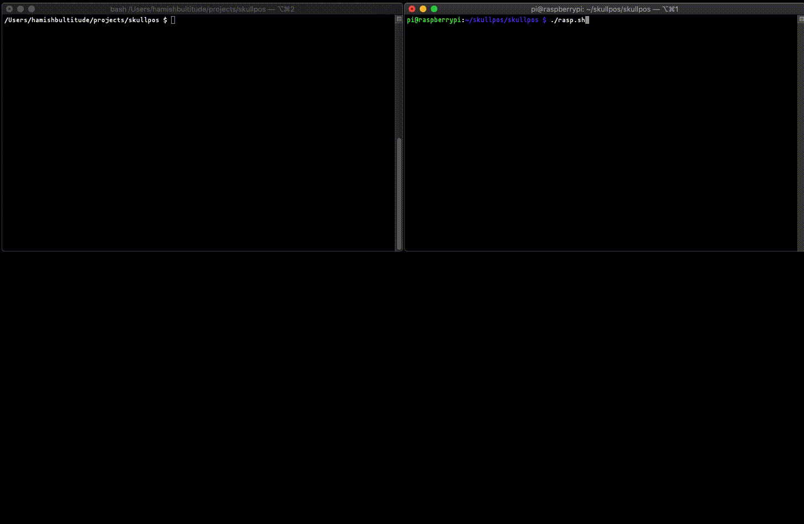
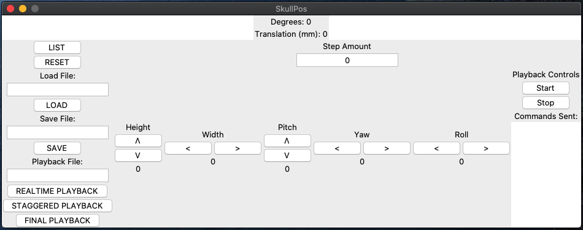

# SkullPos - Software for SkullBot

Craniofacial Superimposition device over Ethernet between a RPI3 and *nix machine. Interface via command line or graphical interface modes.

This project was completed under the guidance of Carl Stephan of UQ.



## Quick Start

Uses Python 3 and the TCP/IP stack to communicate with a Raspberry Pi.

Run `./rasp-install.sh` to enable all requirements on the Raspberry Pi machine. Similarly `./mach-install.sh` for the client.

Run `./rasp.sh` on the Raspberry Pi to begin the server process. Note the ipv4 address in the format ```000.000.000.000```.

Run `./mach.sh <addr>` on your host machine connected to the Raspberry Pi via Ethernet, where <addr> is the ipv4 address. This will start the program in GUI mode.



## Commands

### General

Use `pitch`, `yaw`, `roll`, `height` and `width` like so `<cmd>::<amount>` where `amount` is the value to operate the servo by.

`save::<name>` to save the current position of the device to disk for later use.

`load::<name>` to load a profile onto the Pi with the given name from disk.

`list` to see all current profiles on disk.

`reset` to reset all positions to their origin.

`close` to politely close the connection. `^C` also works too.

### Playback 
`playback::START` to begin recording of commands

`playback::END` to end recording of commands, outputs history to a PDF file.

`playback::<file_name>` to begin playback of a file with a particular name. Must be located in the `playbacks/` folder.

`playback::IRL` to set playback mode to perform in *real time* (i.e. playback of commands occurs with the time delay originally performed at).

`playback::CONTROL` to set playback mode to perform the next command with input from the user (i.e. hitting any key).

`playback_final::<file_name>` jump straight to the final position of a SkullBot session file. Must be located in the `playbacks/` folder.

By default, on starting the software, all commands sent across to SkullBot are recorded in a file with the date and time that SkullBot was accessed for that session. This is found in the `playback/` directory.

To turn this off, use the flag `-no_playback` when starting `./mach.sh`.

See above for a list of commands to control playback.

## Profile format

All position profiles are stored in `profiles.json` in the home directory for easy to edit formatting. See the file for formatting examples.

## Miscellaneous
If GUI mode is undesirable, run `python3 mach.py <addr>` to communicate with the Raspberry Pi, where `<addr>` is the ipv4 address given above. This will connect to the Pi over ethernet in *command line mode*, thus you will have to issue commands (specified in [Commands](##Commands)).

## Contributors

`m-ish` - Hamish Bultitude
