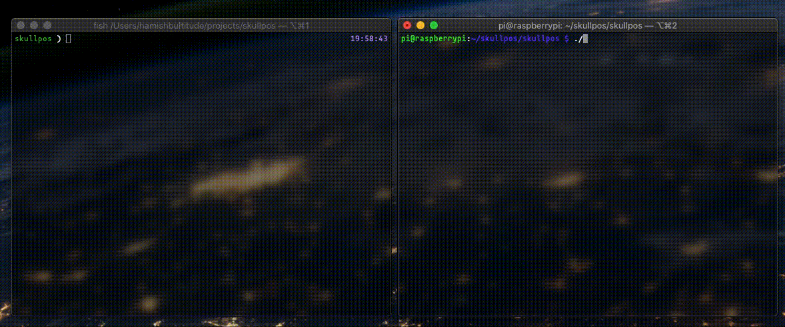

# skullpos
Craniofacial positioning device w/ bluetooth between a RPI3 and UNIX machine



## Quick Start
Uses Python 3 and the Bluetooth Stack to communicate with a Raspberry Pi.

Run `./rasp-install.sh` to enable all requirements on the Raspberry Pi machine. Similarly `./mach-install.sh` for the client.

Run `./start.sh` on the Raspberry Pi to begin the server process. Note the bluetooth address in the format ```00:00:00:00:00:00```.

Run `python3 mach.py <addr>` to communicate with the Raspberry Pi, where `<addr>` is the bluetooth address given above.

Execute commands of `pitch`, `yaw`, and `height` like so `<cmd>::<amount>` where `amount` is the value to operate the servo by. 

## Contributors
`m-ish` - Hamish Bultitude
